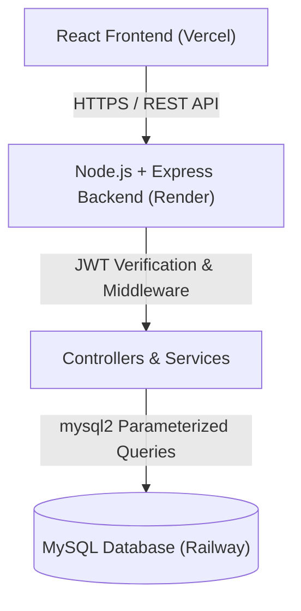

# SmartEdu Student Management Portal

A full-stack, enterprise-ready web application designed to streamline student registration, academic record tracking, attendance management, examination marks recording, and automated grade calculations with multi-role access control.

---

## 1. Project Overview

The **SmartEdu Student Management Portal** provides an intuitive, robust, and secure digital platform for educational institutions. Built with a modern **React (Vite)** frontend and an **Express.js (Node.js)** REST API backed by **MySQL**, SmartEdu simplifies administrative tasks, provides faculty members with fast workflows for recording marks and attendance, and gives students real-time visibility into their academic progress.

---

## 2. Key Features

- 🔐 **Secure Role-Based Authentication**: JWT-based session management with bcrypt password encryption.
- 👥 **Multi-Role Dashboards**: Tailored views and permissions for Students, Faculty (Teachers), and Administrators.
- 📋 **Student Information Management**: Complete student profiles linked with user accounts.
- 📅 **Attendance Tracking & Approvals**: Faculty mark attendance, with admin approval workflows.
- 📊 **Marks & Auto-Grade Calculation**: Automatic calculation of letter grades (O, A+, A, B+, B, C, D, F) based on subject performance.
- 🔔 **Real-Time System Notifications**: Instant notifications for pending approvals, registration events, and grade updates.
- ⚡ **Centralized Administrative Controls**: One-click bulk approval or rejection for pending attendance and marks submissions.
- 📱 **Responsive Dark-Themed Dashboard**: Interactive visualization using Chart.js, statistics cards, and responsive tables.

---

## 3. User Roles

### 🎓 Student (`STUDENT` / `ROLE_STUDENT`)
- View personal academic profile, enrollment details, and assigned user account.
- Check personal attendance history and approved status.
- View approved subject marks and automatically computed letter grades.
- Receive personal notifications regarding attendance or mark approvals.

### 👩‍🏫 Faculty (`TEACHER` / `ROLE_TEACHER`)
- View complete student directory and unassigned student accounts.
- Create new student profiles and update profile details.
- Record and update student attendance (submitted for administrative approval).
- Input and update student marks and total scores (submitted for administrative approval).
- Delete attendance or mark records if necessary.

### 🛡️ Admin (`ADMIN` / `ROLE_ADMIN`)
- Full system access across all modules.
- Create, update, and delete student records.
- Approve or reject individual or bulk attendance and marks submissions.
- Receive administrative notifications for new registrations and pending submissions.
- Manage user-to-student profile linkages.

---

## 4. Technology Stack

- **Frontend**: React.js, JavaScript (ES6+), Vite, Tailwind CSS, Lucide React, Chart.js, React Router DOM
- **Backend**: Node.js, Express.js
- **Database**: MySQL (using `mysql2/promise` connection pooling)
- **Authentication**: JSON Web Tokens (`jsonwebtoken`)
- **Security**: Password hashing with `bcryptjs`, CORS middleware, Parameterized SQL queries
- **Deployment**: Vercel (Frontend), Render (Backend), Railway (Managed MySQL Database)

---

## 5. System Architecture



---

## 6. Main Functionalities

1. **Authentication**: Secure user login (`/api/auth/signin`) and registration (`/api/auth/signup`) returning JWT bearer tokens.
2. **Registration**: Self-service user signup with role assignment (Student, Teacher, Admin).
3. **Student Management**: Full CRUD lifecycle for student profiles, linking user credentials with academic records.
4. **Attendance Management**: Daily attendance tracking (Present, Absent, Late) with state transition tracking (Pending $\rightarrow$ Approved/Rejected).
5. **Marks Management**: Subject-wise mark recording with automated letter grade evaluation.
6. **Notifications**: Role-based and user-specific event notifications stored in MySQL.
7. **Approval Workflows**: Administrative review queue with one-click bulk approval/rejection capability.
8. **Role-Based Access Control (RBAC)**: Strict route protection enforced by custom Express middleware (`requireAuth`, `requireRole`).
9. **CRUD Operations**: Complete Create, Read, Update, and Delete operations across all domain entities.

---

## 7. Project Structure

```
SmartEdu Student Management Portal/
├── smartedu-frontend/              # React.js Vite Frontend Application
│   ├── public/                    # Static assets & icons
│   ├── src/
│   │   ├── assets/                # Logos, SVG icons, imagery
│   │   ├── components/            # Reusable UI components (Navbar, Sidebar, Layout, Notifications)
│   │   ├── context/               # React Context (AuthContext, ThemeContext)
│   │   ├── pages/                 # Route pages (Dashboard, Login, Register, Students, Attendance, Marks, Approvals, Profile)
│   │   ├── services/              # Axios instance configuration (api.js)
│   │   ├── App.jsx                # Application root with router configuration
│   │   ├── index.css              # Custom CSS & design system tokens
│   │   └── main.jsx               # Entry point
│   ├── index.html
│   ├── package.json
│   ├── vite.config.js
│   ├── vercel.json
│   └── .env.example
├── smartedu-backend/               # Express.js Node.js Backend API
│   ├── config/                    # DB connection pool (db.js) & schema initializer (initDb.js)
│   ├── controllers/               # Controller request handlers
│   ├── middleware/                # JWT Auth, Role validation & centralized Error middleware
│   ├── routes/                    # Express Router definitions
│   ├── services/                  # Business logic & SQL execution layers
│   ├── utils/                     # JWT helper utilities
│   ├── Dockerfile                 # Optional container deployment file
│   ├── package.json
│   ├── render.json                # Render deployment configuration schema
│   ├── schema.sql                 # MySQL schema definitions
│   ├── server.js                  # Express application entry point
│   └── .env.example
├── README.md                      # Project documentation
├── vercel.json                    # Monorepo deployment settings
└── .gitignore
```

---

## 8. API Overview

### 🔑 Authentication
| Method | Endpoint | Auth Required | Allowed Roles | Description |
| :--- | :--- | :---: | :---: | :--- |
| `POST` | `/api/auth/signin` | ❌ No | Public | Authenticate user credentials & return JWT |
| `POST` | `/api/auth/signup` | ❌ No | Public | Register new user account |

### 👥 Users & Profiles
| Method | Endpoint | Auth Required | Allowed Roles | Description |
| :--- | :--- | :---: | :---: | :--- |
| `GET` | `/api/users/students/unassigned` | ✅ Yes | Admin, Teacher | Fetch users with STUDENT role lacking profile |
| `PUT` | `/api/users/:id` | ✅ Yes | Admin, Teacher, Student | Update user profile credentials |

### 🎓 Students
| Method | Endpoint | Auth Required | Allowed Roles | Description |
| :--- | :--- | :---: | :---: | :--- |
| `POST` | `/api/students` | ✅ Yes | Admin, Teacher | Create a new student record |
| `GET` | `/api/students` | ✅ Yes | Admin, Teacher | Retrieve all student records |
| `GET` | `/api/students/me` | ✅ Yes | Student | Retrieve logged-in student profile |
| `GET` | `/api/students/user/:userId` | ✅ Yes | Admin, Teacher, Student | Retrieve student by user ID |
| `GET` | `/api/students/:id` | ✅ Yes | Admin, Teacher | Retrieve student record by ID |
| `PUT` | `/api/students/:id` | ✅ Yes | Admin, Teacher | Update student record |
| `DELETE` | `/api/students/:id` | ✅ Yes | Admin | Delete student record |

### 📅 Attendance
| Method | Endpoint | Auth Required | Allowed Roles | Description |
| :--- | :--- | :---: | :---: | :--- |
| `POST` | `/api/attendance` | ✅ Yes | Admin, Teacher | Record student attendance |
| `GET` | `/api/attendance` | ✅ Yes | Admin, Teacher | Fetch all attendance records |
| `GET` | `/api/attendance/student/:studentId` | ✅ Yes | Admin, Teacher, Student | Fetch attendance for specific student |
| `PUT` | `/api/attendance/:id` | ✅ Yes | Admin, Teacher | Update attendance record |
| `PUT` | `/api/attendance/:id/approve` | ✅ Yes | Admin | Approve attendance submission |
| `PUT` | `/api/attendance/:id/reject` | ✅ Yes | Admin | Reject attendance submission |
| `DELETE` | `/api/attendance/:id` | ✅ Yes | Admin, Teacher | Delete attendance record |

### 📝 Marks
| Method | Endpoint | Auth Required | Allowed Roles | Description |
| :--- | :--- | :---: | :---: | :--- |
| `POST` | `/api/marks` | ✅ Yes | Admin, Teacher | Enter student marks & auto-compute grade |
| `GET` | `/api/marks` | ✅ Yes | Admin, Teacher | Fetch all marks records |
| `GET` | `/api/marks/student/:studentId` | ✅ Yes | Admin, Teacher, Student | Fetch marks for specific student |
| `PUT` | `/api/marks/:id` | ✅ Yes | Admin, Teacher | Update marks record |
| `PUT` | `/api/marks/:id/approve` | ✅ Yes | Admin | Approve marks submission |
| `PUT` | `/api/marks/:id/reject` | ✅ Yes | Admin | Reject marks submission |
| `DELETE` | `/api/marks/:id` | ✅ Yes | Admin, Teacher | Delete marks record |

### 🔔 Notifications & Approvals
| Method | Endpoint | Auth Required | Allowed Roles | Description |
| :--- | :--- | :---: | :---: | :--- |
| `GET` | `/api/notifications` | ✅ Yes | All Authenticated | Fetch notifications for logged-in user |
| `PUT` | `/api/notifications/:id/read` | ✅ Yes | All Authenticated | Mark notification as read |
| `PUT` | `/api/notifications/read-all` | ✅ Yes | All Authenticated | Mark all user notifications as read |
| `GET` | `/api/approvals/pending` | ✅ Yes | Admin | Get list of pending attendance and marks |
| `PUT` | `/api/approvals/approve-all` | ✅ Yes | Admin | Approve all pending requests in queue |
| `PUT` | `/api/approvals/reject-all` | ✅ Yes | Admin | Reject all pending requests in queue |
| `GET` | `/api/health` | ❌ No | Public | Health check endpoint for deployment monitoring |

---

## 9. Database Schema

The database consists of 5 relational MySQL tables:

1. **`users`**: Stores user authentication credentials, email addresses, and system roles (`ADMIN`, `TEACHER`, `STUDENT`).
2. **`students`**: Stores student biographical details (name, DOB, enrollment date, phone, address) with foreign key linkage to `users.id`.
3. **`attendance`**: Records date-wise attendance status (`PRESENT`, `ABSENT`, `LATE`) and approval state (`PENDING`, `APPROVED`, `REJECTED`).
4. **`marks`**: Stores subject-wise marks, total marks, calculated letter grades, and approval status.
5. **`notifications`**: Stores real-time user notification messages, timestamps, and read state.

---

## 10. Environment Variables

### Backend Configuration (`smartedu-backend/.env`)
```env
NODE_ENV=development
PORT=5000
DB_HOST=localhost
DB_PORT=3306
DB_USER=root
DB_PASSWORD=your_mysql_password
DB_NAME=smartedu
JWT_SECRET=your_super_secret_jwt_key
JWT_EXPIRES_IN=24h
FRONTEND_URL=http://localhost:5173
```

### Frontend Configuration (`smartedu-frontend/.env`)
```env
VITE_API_URL=http://localhost:5000/api
```

---

## 11. Local Installation

### Prerequisites
- Node.js (v18 or higher)
- npm
- MySQL Server (v8.0 or higher)

### Setup Steps
1. **Clone the Repository**:
   ```bash
   git clone https://github.com/ankittech68/smartedu-student-managementt.git
   cd smartedu-student-managementt
   ```

2. **Install Backend Dependencies**:
   ```bash
   cd smartedu-backend
   npm install
   ```

3. **Install Frontend Dependencies**:
   ```bash
   cd ../smartedu-frontend
   npm install
   ```

4. **Configure Environment Variables**:
   - Copy `.env.example` to `.env` in `smartedu-backend/` and configure your local MySQL credentials.
   - Copy `.env.example` to `.env` in `smartedu-frontend/` and set `VITE_API_URL=http://localhost:5000/api`.

---

## 12. Running the Application

1. **Start the Backend Server**:
   ```bash
   cd smartedu-backend
   npm run dev
   ```
   *(The server initializes database tables and seeds demo accounts automatically upon startup on `http://localhost:5000`)*.

2. **Start the Frontend Application**:
   ```bash
   cd smartedu-frontend
   npm run dev
   ```
   *(Open `http://localhost:5173` in your web browser)*.

---

## 13. Production Deployment

### Live Architecture
- **Frontend**: Deployed on **Vercel** (`https://smartedu-student-managementt.vercel.app`)
- **Backend**: Deployed on **Render** (`https://smartedu-student-managementt.onrender.com`)
- **Database**: Cloud MySQL hosted on **Railway**

### Production Environment Variables

#### Render (Backend) Settings:
- `NODE_ENV` = `production`
- `PORT` = *(Dynamically assigned by Render)*
- `DB_HOST` = *(Railway MySQL proxy host)*
- `DB_PORT` = *(Railway MySQL proxy port)*
- `DB_USER` = *(Railway MySQL user)*
- `DB_PASSWORD` = *(Railway MySQL password)*
- `DB_NAME` = `railway` (or `smartedu`)
- `JWT_SECRET` = *(Generated secure production key)*
- `JWT_EXPIRES_IN` = `24h`
- `FRONTEND_URL` = `https://smartedu-student-managementt.vercel.app`

#### Vercel (Frontend) Settings:
- `VITE_API_URL` = `https://smartedu-student-managementt.onrender.com/api`

---

## 14. Security Features

- 🔑 **Password Hashing**: Industry-standard password hashing using `bcryptjs` (salt rounds: 10).
- 🛡️ **JWT Authentication**: Stateless authentication utilizing signed JSON Web Tokens passed in Authorization headers.
- 💉 **SQL Injection Defense**: Prepared parameterized queries (`?` placeholders) executed via `mysql2/promise`.
- 🌐 **Configured CORS**: Strict origin whitelisting guaranteeing that cross-origin API calls are only permitted from verified frontend domains.
- 🔒 **Role-Based Access Control**: Declarative Express middleware ensuring endpoints are strictly restricted to authorized user roles.
- 🛡️ **Environment Variable Isolation**: Sensitive secrets and DB credentials excluded from repository commits using git rules.

---

## 15. Future Improvements

- 📄 PDF export functionality for student report cards and attendance transcripts.
- 📧 Automated email notification alerts for password recovery and approval notices.
- 📊 Advanced analytics reporting for term-wise GPA progression.

---

## 16. Author

**Ankit**
- GitHub: [@ankittech68](https://github.com/ankittech68)
